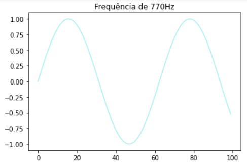
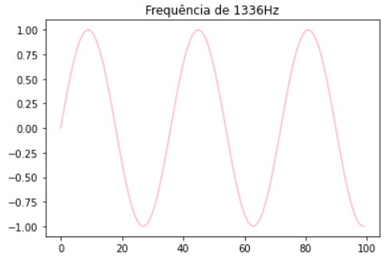
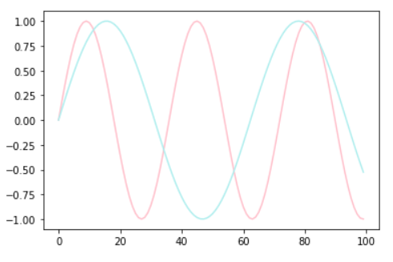
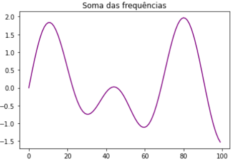

### DTMF - Fourier

# Introdução
  DTMF (Dual Tone Multi-Frequency ou Multifrequência de Tom Duplo) é um sinal de telecomunicação composto por tons de duas frequências diferentes, de modo que cada combinação de frequências corresponda a um caractere, como mostra a tabela. Assim, não é necessário ter uma pessoa para transferir as chamadas telefônicas, já que é possível identificar as frequências de um tom.
                
Hz  |1209|1336|1447|1632|
:--:|:--:|:--:|:--:|:--:|
697 |  1 |  2 |  3 |  A |
770 |  4 |  5 |  6 |  B |
852 |  7 |  8 |  9 |  C |
941 |  * |  0 |  # |  D |

Este projeto visa criar um DTMF e identificar suas frequências à partir de uma gravação.

 

# Bibliotecas e Funções

 

 

# Transformada de Fourier

# Resultados
_Esse exemplo foi feito com as frequências do número 5_
 
### 1. Gerando sinais senoidais das duas frequências

 
### 2. Sinais sobrepostos

 
### 3. Sinais <strong>somados</strong>

